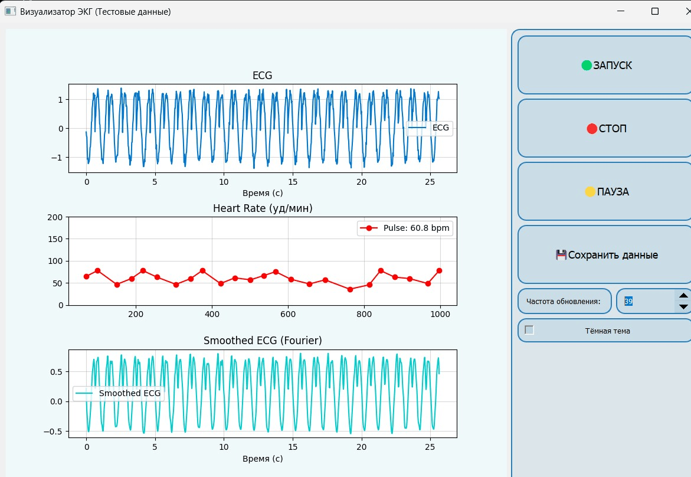

# ECG-Visualizer-Arduino

**ECG-Visualizer** — это Python-программа для отображения ЭКГ в реальном времени.  
Автоматически подключается к COM-порту, визуализирует ЭКГ-сигнал, частоту пульса и спектр сигнала.  
Сохраняет данные в формате CSV. Предназначена для образовательных целей и предварительной оценки ЭКГ.

---

## 🚀 Установка

### 1. Установите Python

Если Python ещё не установлен, скачайте его с [официального сайта](https://www.python.org/downloads/).  
**Важно:** при установке отметьте пункт **"Add Python to PATH"**, чтобы использовать Python из командной строки.

### 2. Установите зависимости

Откройте командную строку (Windows) или терминал (Linux) и выполните:

```bash
pip install PyQt5 numpy scipy pyserial matplotlib
```
Убедитесь, что установка прошла без ошибок.

### 3. Скачайте и распакуйте программу
Скачайте архив `ECG_Visualizer.zip`

Распакуйте его в удобную директорию, например:

`C:\ECG_Visualizer` — для Windows

`/home/user/ECG_Visualizer` — для Linux

### 4. Содержимое архива
`ECG_Visualizer.py` — основной исполняемый файл программы

`libary.txt` — список зависимостей

`examples/` (опционально) — примеры данных ЭКГ в формате CSV

## ▶️ Использование
### 1. Подключите устройство ЭКГ
Подключите ваше устройство ЭКГ (например, Arduino) к компьютеру через COM-порт.
Убедитесь, что оно включено и передаёт данные.

### 2. Перейдите в папку с программой
Откройте терминал/командную строку и выполните:

`cd C:\ECG_Visualizer`       # для Windows
`cd /home/user/ECG_Visualizer`  # для Linux

### 3. Запустите программу

`python ECG_Visualizer.py` - Откроется окно программы "Визуализатор ЭКГ".

### 4. Автоматическое подключение
Программа попытается автоматически подключиться к доступному COM-порту.
Если подключение не удалось, проверьте:
-Устройство ЭКГ подключено и включено
-Установлены драйверы для ЭКГ (если необходимо)
-COM-порт не занят другим приложением

---

## 🖥 Интерфейс программы

Интерфейс представлен на рисунке:



Интерфейс ECG-Visualizer включает следующие элементы:

- **График ЭКГ**  
  Отображает данные электрокардиограммы в реальном времени.  
  - Ось **X** — время (в секундах)  
  - Ось **Y** — амплитуда сигнала ЭКГ (в условных единицах)

- **График пульса**  
  Показывает частоту сердечных сокращений (пульс) в ударах в минуту (BPM)

- **График Фурье (сглаженная ЭКГ)**  
  Показывает сигнал, обработанный преобразованием Фурье, для анализа частотных компонентов

- **🟢 Кнопка "ЗАПУСК"**  
  Начинает считывание и отображение данных с COM-порта

- **🔴 Кнопка "СТОП"**  
  Останавливает приём данных и очищает графики

- **🟡 Кнопка "ПАУЗА"**  
  Приостанавливает поток данных без очистки графиков — удобно для анализа

- **💾 Кнопка "Сохранить данные"**  
  Сохраняет текущие данные ЭКГ, пульса и статистику в файл CSV

- **⏱ Счётчик "Частота обновления" (FPS)**  
  Позволяет задать частоту обновления графиков от **30 до 250 FPS**  
  Высокое значение = плавная отрисовка, но выше нагрузка на процессор

- **🌙 Чекбокс "Тёмная тема"**  
  Переключение между светлой и тёмной цветовой схемой интерфейса

---

## 🧪 Работа с программой

### 1. 🚀 Запуск

После запуска программы, если устройство ЭКГ подключено и доступно — данные начнут отображаться автоматически.  
Если этого не произошло, нажмите кнопку **🟢 "ЗАПУСК"** вручную.

### 2. ⚙️ Настройка частоты обновления

Используйте счётчик **"Частота обновления"** (в правой части окна) для настройки скорости отрисовки графиков.  
- Рекомендуется начинать с **30 FPS**
- Постепенно увеличивайте значение до комфортной плавности
- Более высокие значения требуют больше ресурсов компьютера

### 3. ⏸ Пауза

Нажмите **🟡 "ПАУЗА"** (6), чтобы временно остановить отображение данных.  
Для возобновления нажмите **🟢 "ЗАПУСК"** (4).

### 4. 💾 Сохранение данных

Чтобы сохранить текущие данные ЭКГ и пульса:

1. Нажмите кнопку **"💾 Сохранить данные"** (7)
2. В появившемся окне выберите папку и задайте имя файла (например, `ECG_Data.csv`)
3. Нажмите **"Сохранить"**
4. Будет создан CSV-файл со следующими столбцами:

| Поле             | Описание                              |
|------------------|----------------------------------------|
| `Date`           | Дата записи                            |
| `Time`           | Время записи                           |
| `Minimum pulse`  | Минимальный пульс (BPM)                |
| `Average pulse`  | Средний пульс (BPM)                    |
| `Maximum pulse`  | Максимальный пульс (BPM)               |
| `Minimum EMG`    | Минимальное значение ЭКГ               |
| `Average EMG`    | Среднее значение ЭКГ                   |
| `Maximum EMG`    | Максимальное значение ЭКГ              |

### 5. 🌗 Тёмная тема

Установите или снимите флажок **"Тёмная тема"** (9), чтобы переключиться между светлой и тёмной схемой интерфейса.  
Тёмная тема особенно удобна при длительной работе или в условиях низкой освещённости.

### 6. 🔍 Масштабирование графиков

Для увеличения/уменьшения масштаба графиков:

- Наведите курсор на нужный график
- Прокрутите **колесо мыши** вверх или вниз

Это позволяет детально рассмотреть участки сигнала.

---

## 🚨 Аварийные ситуации и их решения

### ❌ Нет сигнала ЭКГ

Если после запуска программы не отображается сигнал ЭКГ:

1. **Проверьте подключение** — убедитесь, что устройство ЭКГ подключено к COM-порту
2. **Убедитесь, что устройство включено** — и получает питание
3. **Проверьте драйверы** — убедитесь, что установлены все необходимые драйверы
4. **Перезапустите программу** — полностью закройте и снова запустите ECG_Visualizer
5. **Проверьте кабель COM-порта** — возможно, он повреждён или неплотно подключён
6. **Проверьте, не занят ли COM-порт** другим приложением

---

### 🧊 Программа зависает

Если программа перестала отвечать или работает с задержкой:

1. **Закройте лишние приложения** — это освободит ресурсы системы
2. **Перезапустите ECG_Visualizer**
3. **Перезагрузите компьютер**
4. **Уменьшите частоту обновления** — снизьте значение в счётчике FPS (например, до 30)

---

### 📉 Некорректное отображение данных (шум, артефакты, искажения)

Если графики отображаются с искажениями или сильно зашумлены:

1. **Проверьте электроды** — они должны плотно прилегать к коже, кожа должна быть чистой  
   Используйте электродный гель для улучшения контакта
2. **Избегайте движения** — во время записи желательно минимизировать движения пациента
3. **Устраните электрические помехи** — отключите/удалите электроприборы рядом с ЭКГ-устройством
4. **Проверьте параметры COM-порта** — убедитесь, что скорость порта соответствует настройкам устройства

---

---

## 📚 Перечень принятых сокращений

- **ЭКГ** — Электрокардиография
- **BPM** — Beats Per Minute (удары в минуту)
- **COM** — Communication Port (последовательный порт)
- **CSV** — Comma Separated Values (значения, разделённые запятыми)
- **FPS** — Frames Per Second (кадров в секунду)
- **GUI** — Graphical User Interface (графический интерфейс пользователя)
- **RAM** — Random Access Memory (оперативная память)
- **CPU** — Central Processing Unit (центральный процессор)

---


## ⚠️ Важно
-Программа предназначена исключительно для учебных и демонстрационных целей
-Это не медицинское ПО и не может использоваться для диагностики

## 📄 Лицензия
Свободна для использования и модификации в образовательных и некоммерческих целях.
